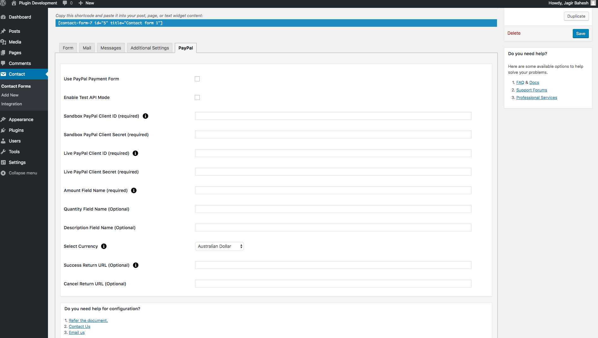
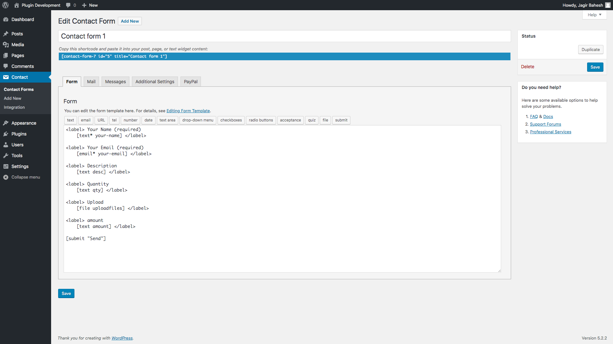
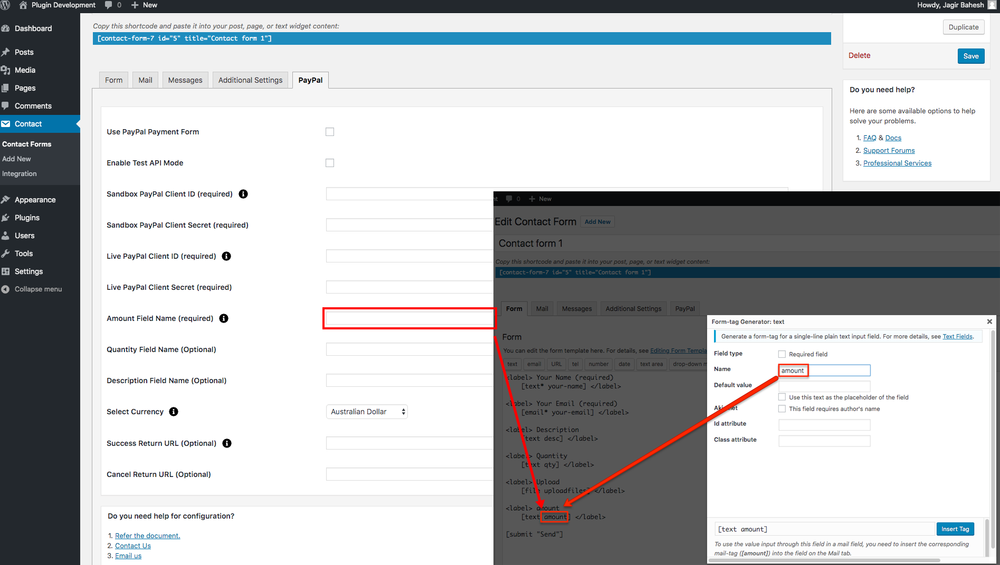

# contact-form-7-paypal-extension
The payment collection is possible with the form using this plugin. Accept PayPal Payments Using Contact Form 7 will solve all integration problems efficiently. As the newly extended plugin seamlessly integrates PayPal with Contact Form 7 by allowing the WordPress developers, to add a PayPal submit button in the contact form 7 that redirects to PayPal’s website so that you can continue with secure payment. After submitting the form, the payment is one click away.

# Installation
1. Download the plugin zip file from WordPress.org plugin site to your desktop / PC
2. If the file is downloaded as a zip archive, extract the plugin folder to your desktop.
3. With your FTP program, upload the plugin folder to the wp-content/plugins folder in your WordPress directory online
4. Go to the Plugin screen and find the newly uploaded Plugin in the list.
5. Click ‘Activate Plugin’ to activate it.

# How To Use

You have to configure it from wp-admin > Contact > Add/Edit Contact Forms (Contact Form 7 needs to be activated before).

Like other tabs of Contact Form 7, you will find a new tab “PayPal Plugin Pro” using this you can submit your form and redirect to PayPal and make payment.

- **Use the PayPal Payment Form**
Check the PayPal Payment Form for PayPal submit button activation.

- **Enable Test API Mode**
Check the Enable Test API Mode to enable Sandbox for test mode.

- **Enable Debug Mode**
Check the Enable Debug Mode to start transaction debugging.

- **Sandbox PayPal Client Id (required)**
This field is required when you have set PayPal mode to sandbox if your site is in test mode.

- **Sandbox PayPal Client Secret (required)**
This field is required when you have set PayPal mode to sandbox if your site is in test mode. Enter the merchant’s Secret key of your PayPal account.

- **Get your API test credentials:**
The PayPal Developer site also assigns each sandbox Business account a set of test

API credentials. Log in to the PayPal Developer site and navigate to the Sandbox
Accounts page or Dashboard > Sandbox > Accounts. View your test API credentials by clicking the expand icon next to the business account you want to use in your request. Then, navigate to the Profile > API credentials tab of the sandbox account.

- **Live PayPal Client Id (required)**
This field is required when you have set PayPal mode to live if your site is in live mode.

- **Live PayPal Client Secret (required)**
This field is required when you have set PayPal mode to live if your site is in live mode.

- **Get your REST API credentials:**
You can view and manage the REST API sandbox and live credentials on the PayPal
Developer site My Apps & Credentials page. Within the setting for each of your apps, use Live toggle in the top right corner of the app settings page to view the API credentials and default PayPal account for each of these environments. If you have not created an app, navigate to the My Apps & Credentials page.

- **Amount Field Name (required)**
You have to set a name attribute to any of your fields of Contact Form 7 like drop-down menu, textbox, hidden field, radio buttons, etc., from which you need to pass an amount value to the PayPal website.

For example, [hidden price "20"] This is a hidden field with the name “price”. You will need to set “price” in this Amount Field Name of PayPal tab.

- **Quantity Field Name (optional)**
You have to set a name attribute to any of your fields of Contact Form 7 like drop-down menu, textbox, hidden field, radio buttons, etc. from which you need to pass the quantity of the item to the PayPal website.

For example, [radio quantity "1" "2" "3"] This is a radio button field with the name “quantity”. You will need to set “quantity” in this Quantity Field Name of PayPal tab.

- **Description Field Name (optional)**
You have to set a name attribute to the text field of Contact Form 7 from which you need to pass the description of the item to the PayPal website.

- **Select Currency**
You can select your currency here. Default is set as AUD (Australian Dollar).

- **Success Return URL (optional)**
You can enter the URL of the page to redirect for a Successful PayPal Payment transaction.

- **Cancel Return URL (optional)**
You can enter the URL of the page to redirect if a transaction fails.

       Getting Help

If you have any difficulties while using this Plugin, please feel free to contact us at opensource@zealousweb.com. We also offer custom WordPress extension development and WordPress theme design services to fulfill your e-commerce objectives. Our professional dy‐ namic WordPress experts provide profound and customer-oriented development of your project within short timeframes. Thank you for choosing a Plugin developed by ZealousWeb!

